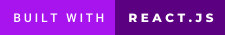

  

<h1 align="center">
  Sabrina Centeno's Portfolio
</h1>

 

## Welcome!!

Hello, it is possible you are here for three scenarios:

1. You are trying to hire me and are looking at my projects, please continue.
2. You liked my work and are trying to get inspiration, I have been in your position.
3. You're just curious about my GitHub.
   In any case, please feel welcome to continue browsing and getting ideas! I am extremely proud of this portfolio. 
   It represents me and what I love. This is one of the websites that will show you my passion for coding and everything that one can create with it.
   Thank you for stopping by my portfolio, and I truly hope you enjoyed it!

## Credits

This portfolio was created with a lot blood, sweat and tears overnight and during early mornings by yours truly.
(Amazing badges by forthebadge.com)

## License

This portfolio is released under the MIT License. You are free to use, modify, and distribute this application as per the terms of this license.
